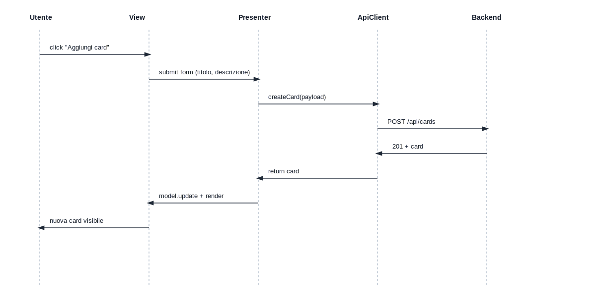
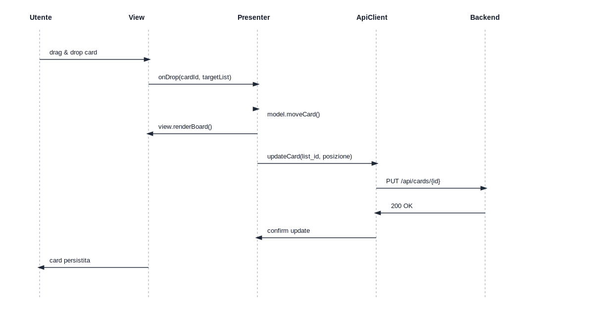
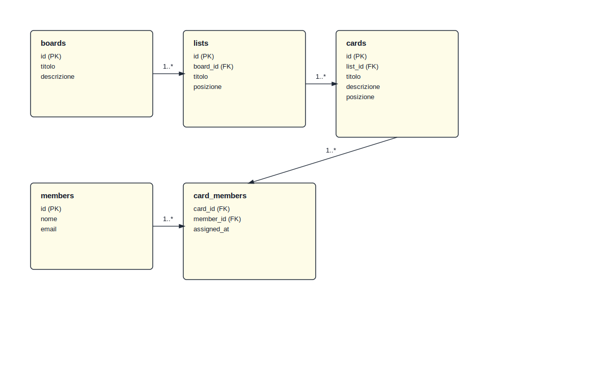

# Analisi requisiti & specifiche (Fase 1)

## Obiettivo del progetto
Realizzare un clone semplificato di Trello: una bacheca Kanban collaborativa per la gestione di progetti di gruppo. Le funzionalità principali includono gestione di Board, Liste e Card, drag-and-drop sul frontend e persistenza delle modifiche via API backend.

## Vincoli tecnologici
- Frontend: HTML, CSS, JavaScript.
- Backend: PHP.
- Comunicazione: solo tramite API RESTful CRUD (JSON).
- Architettura applicativa: Model-View-Presenter (MVP).
- Vietato generare HTML con PHP.
- Vietato usare framework architetturali (es. Node.js, Laravel, React).
- Consentite librerie di impaginazione (es. Bootstrap) o utility (es. jQuery).
- Frontend e backend devono essere intercambiabili senza riscritture reciproche (contratto API stabile).

## Attori e ruoli
- **Utente**: utilizza la bacheca per organizzare attività di gruppo.
- **Membro**: può essere assegnato a una Card (assenza di autenticazione nella fase base).

## Entità principali (dominio)
1. **Board**
   - Contiene più Liste.
2. **Lista**
   - Appartiene a una Board.
   - Contiene più Card.
3. **Card**
   - Appartiene a una Lista.
   - Può avere titolo, descrizione, assegnatari, posizione.
4. **Membro** (opzionale, per assegnazioni)
   - Attributi base: nome, email (o alias).

## Funzionalità minime (MVP di prodotto)
- **Board**
  - Creare, leggere, aggiornare, eliminare.
- **Liste**
  - Creare, leggere, aggiornare, eliminare all’interno di una Board.
- **Card**
  - Creare, leggere, aggiornare, eliminare all’interno di una Lista.
  - Spostare tra liste con drag-and-drop.
- **Persistenza**
  - Ogni modifica deve essere salvata via API (CRUD).

## Requisiti non funzionali
- UI semplice, chiara, responsive.
- Nessun rendering HTML lato backend.
- Separazione completa: frontend consumatore di API, backend solo JSON.
- Compatibilità con swap di backend (es. Java/Go) mantenendo le stesse API.

## Contratto API (bozza)
> Dettaglio completo nella fase 2.
- **/api/boards**
  - GET, POST
- **/api/boards/{id}**
  - GET, PUT, DELETE
- **/api/lists**
  - GET, POST (filtrabili per board)
- **/api/lists/{id}**
  - GET, PUT, DELETE
- **/api/cards**
  - GET, POST (filtrabili per list)
- **/api/cards/{id}**
  - GET, PUT, DELETE

## Struttura frontend (MVP)
- **Model**: stato locale (board/liste/card) + adapter API.
- **View**: DOM + template statici HTML.
- **Presenter**: logica UI + orchestrazione chiamate API.

## Diagrammi UML ed ER
I diagrammi sono disponibili nella cartella `docs/uml/`.

### Diagramma delle classi (MVP + ApiClient + entità)

### Diagrammi di sequenza

### Diagramma ER database

## Checklist fase 1 (completata)
- [x] Requisiti e vincoli raccolti.
- [x] Entità di dominio definite.
- [x] Funzionalità minime elencate.
- [x] Bozza contratto API.
- [x] Struttura MVP delineata.
